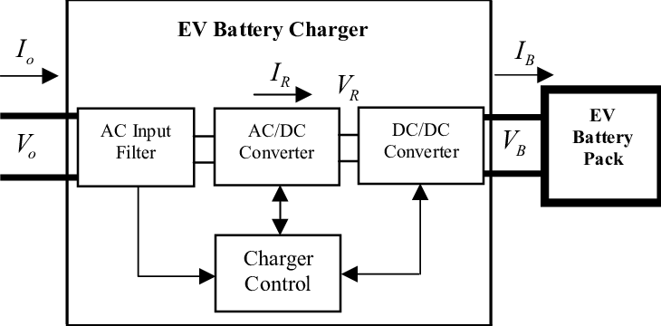

# Fast Off-board Charger for Electric Vehicles

Welcome to the Fast Off-board Charger for Electric Vehicles project! This project aims to develop a robust and efficient off-board charging solution for electric vehicles (EVs). The system is designed to go through several stages: from the grid to the AC filter, then to the AC/DC conversion, followed by the DC-link, DC/DC conversion, and finally to the battery.

  

## Repository Hierarchy

The repository is organized into the following directories:

- [**AC_DC_Conversion**](./AC-DC_Conversion): Contains all the files and scripts related to the AC to DC conversion process.
- [**DC_DC_Conversion**](./DC-DC_conversion): Includes the components and code for the DC to DC conversion phase.
- [**Charger_Integration**](./Charger_Integration): Integrates all the components of the charger system.
- [**Documentation**](./Documentation): Comprehensive documentation of the project, including design decisions, testing procedures, and user guides.
- [**media**](./media): Contains all the media files, including images and diagrams used in the README and documentation.

## Project Phases

1. **Grid Connection**: Connection from the grid to the system.
2. **AC Filter**: Filtering the alternating current.
3. **AC/DC Conversion**: Converting alternating current (AC) to direct current (DC).
4. **DC-Link**: Stabilizing the DC voltage.
5. **DC/DC Conversion**: Converting to the required DC voltage levels.
6. **Battery Charging**: Charging the electric vehicle battery.

## Team Members

This project was a collaborative effort by a team of dedicated students. The team was divided into two subteams:

### AC/DC Conversion Subteam

- Hassan Tarek Ali Hassan
- Mahmoud Yosry Mostafa Moussa
- Muhammad Ibrahim Gaber Ibrahim 
- Mennat Allah Hassan Ali 
- Yousef Mohamed Zaghlol Elsenosy Balbaa
- Alaa Ashraf Mohamed Abdelhalim

### DC/DC Conversion Subteam

- Nouran Ahmed El-Sayed Ahmed Darwish
- Ahmed Saeed Abdullatif Ebrahim Abo-Eita
- Mohamed Raafat Abdelgaber Ragab
- Ahmed Mostafa Kamel El-Tahan
- Mennat Allah Khaled Ali Barakat
- Moamen Mohamed Eltayeb

## How to Use This Repository

To get started with the project, follow these steps:

1. Clone the repository:
   ```sh
   git clone https://github.com/MennatAllahhxx/Fast-OFBC-Graduation-Project.git
   ```
2. Navigate to the desired directory:
   ```sh
   cd Fast-OFBC-Graduation-Project
   ```
Feel free to explore the directories and read through the documentation for detailed information on each phase of the project.

## License

This project is licensed under the MIT License. See the [LICENSE](LICENSE) file for details.

## Contact

For any inquiries or further information, please contact hassan.t.ali1998@gmail.com
